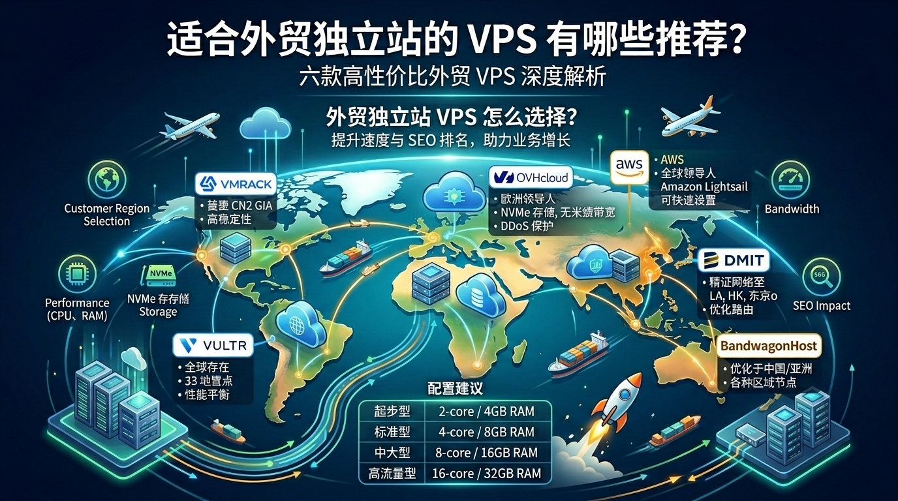
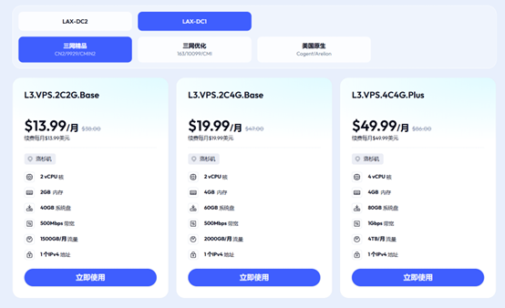
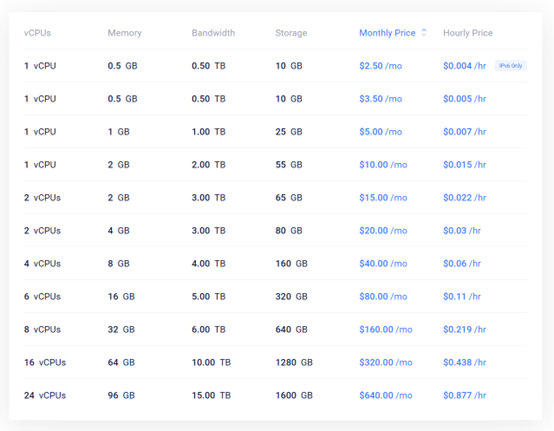
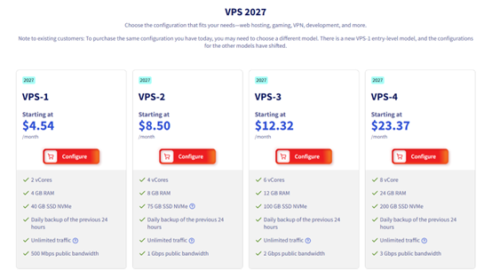
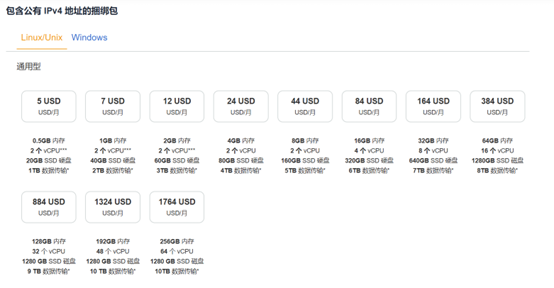
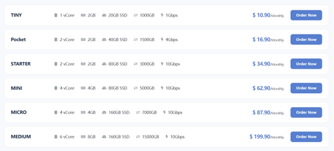
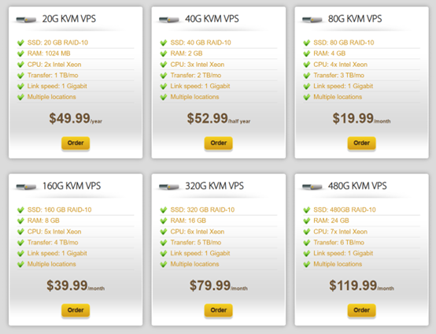

# 外贸独立站 VPS 怎么选择？六款高性价比 VPS 推荐

在选择外贸独立站的 **VPS**（Virtual Private Server，虚拟专用服务器）时，首先你需要明确你的**客户在哪个地区**。你的客户在哪个地区，服务器就选择哪个地区。

这样做的好处是可以提升独立站的访问速度，避免因选错 VPS 地区而导致独立站访问延迟高、页面加载速度慢。

除了 VPS 的地区之外，还需考虑外贸独立站 VPS 的**性能**。

外贸独立站与普通网站不同，其涉及到复杂的商品数据库查询、购物车结算、第三方支付回调以及动态页面加载。如果 VPS 的性能差，不仅会导致用户流失，还会严重影响 Google SEO 排名。

## 外贸独立站 VPS 配置推荐

| 类型   |  CPU |   内存 | 存储         |      带宽 | 适用场景          |
| ---- | ---: | ---: | ---------- | ------: | ------------- |
| 起步型  |  2 核 |  4GB | 50GB NVMe  | 100Mbps | 新上线的外贸独立站     |
| 标准型  |  4 核 |  8GB | 100GB NVMe | 200Mbps | 常规外贸独立站       |
| 中大型  |  8 核 | 16GB | 200GB NVMe | 500Mbps | 高访问量商城的独立站    |
| 高流量型 | 16 核 | 32GB | 500GB NVMe |   1Gbps | 大型跨境电商或复杂业务系统 |

## 六款高性价比外贸独立站 VPS 推荐

以上介绍了外贸独立站 VPS 怎么选择，那么具体有哪些适合外贸独立站的 VPS 商家值得推荐呢？

接下来，将为大家推荐六款适合外贸独立站的高性价比 VPS，一起来看看吧！

### 一、VMRack

对于外贸独立站、海外 WordPress 网站、跨境业务以及对**线路质量**要求较高的企业用户，VPS 推荐 [VMRack](https://www.vmrack.net?ref_code=5dqX11bh32X) 云服务提供商。

其 VPS 产品以**美国三网精品线路**为特色，支持 CN2 GIA、AS9929、CMIN2 等线路，适合对**网络质量**、**访问稳定性**有较高要求的用户。

VMRack 是 **EasyLink** 旗下的自研云基础设施品牌，总部位于美国洛杉矶，多年来专注于全球互联网基础设施与云服务领域的建设与运营。

VMRack 同时提供裸金属服务器、服务器托管、CDN、对象存储等服务，能够满足从个人开发者到企业用户的不同部署需求。

### 二、Vultr

[Vultr](https://www.vultr.com/) 是一家面向全球用户的云计算服务商，凭借较稳定的性能和广泛的服务器布局，适合外贸独立站和海外 WordPress 建站。

相比低价型 VPS，Vultr 的价格优势并不突出，但整体**稳定性**和**性能**一致性较好，更适合长期运行的网站。

不过，实际体验仍会受到机房位置、VPS 配置和使用时间等因素影响。

Vultr 目前在全球 **33** 个云数据中心区域提供基础设施，覆盖北美、南美、欧洲、亚洲、澳洲、非洲和中东，可根据目标客户所在地选择合适的服务器。

### 三、OVHcloud

[OVHcloud](https://us.ovhcloud.com/) 是一家总部位于法国的全球云计算服务商，适合需要稳定运行外贸独立站、WordPress 和跨境电商网站的用户。

其 VPS 采用 **NVMe** 存储，提供**独立资源**、可扩展配置和最高 3Gbps 公网带宽，并提供不限流量方案，同时内置 **Anti-DDoS** 防护和自动备份，比较适合对网络资源和长期稳定性有要求的网站。

OVHcloud 的优势还在于**全球化**基础设施布局，目前拥有 **46** 个数据中心和 **31** 个 Local Zones，覆盖**欧洲**、**北美**、**亚太**等地区，可以根据目标客户所在地选择更近的地区，以降低访问延迟。

对于面向欧美市场的外贸独立站、海外 WordPress 网站以及需要较大带宽和流量的网站，OVHcloud 是一个不错的选择。

### 四、AWS

[Amazon Web Services](https://aws.amazon.com/cn/)（AWS）是全球领先的云计算服务商，拥有覆盖全球的云基础设施，适合外贸独立站、WordPress 和跨境电商网站部署。

用户可以根据目标市场选择合适的地区，以降低访问延迟。

对于外贸独立站，**Amazon Lightsail** 是一个不错的选择，支持 WordPress 一键部署，并提供 SSD 存储、静态 IP、DNS 和快照等功能，适合个人站长和中小企业。

对于大型网站或复杂业务，则可以选择 Amazon EC2 及其他 AWS 云服务。

### 五、DMIT

[DMIT](https://www.dmit.io/aff.php?aff=22319) 是一家以**网络线路**和**跨区域连接质量**为特色的 VPS 服务商，提供**洛杉矶**、**香港**、**东京**等数据中心。

其中洛杉矶 Premium 网络支持包括 CN2 GIA 在内的优质线路，适合对中国大陆及亚太地区访问速度、延迟和稳定性有较高要求的网站。

对于外贸独立站、跨境业务以及需要兼顾中国大陆访问的企业网站，DMIT 可以作为 VPS 选择。

尤其是目标用户分布在美国、亚洲或中国大陆周边地区时，可以根据用户所在地选择洛杉矶、香港或东京的服务器。

### 六、BandwagonHost

[BandwagonHost](https://bandwagonhost.com/)（搬瓦工）是一家以 VPS 网络线路和多地区机房为特色的海外 VPS 服务商，提供**美国**、**加拿大**、**日本**、**香港**、**欧洲**等多个地区的 VPS，并采用 KVM/KiwiVM 虚拟化技术，支持完整 Root 权限、自动备份和快照等功能。

搬瓦工的优势主要在于 CN2 GIA、CMIN2、中国联通 Premium 等精品线路，部分美国、日本、香港节点针对中国大陆访问进行了线路优化。

对于外贸独立站、海外 WordPress，以及需要兼顾中国大陆访问速度的跨境业务网站，搬瓦工比较值得考虑。

## 结语

对于外贸独立站来说，VPS 选型**不能只看价格和配置**，还需要综合考虑**服务器位置**、**线路质量**、**性能**、**带宽**以及后期扩展能力。

如果主要面向欧美市场，应优先选择距离目标客户较近、网络稳定的服务器，并根据网站规模选择合适的 CPU、内存和存储配置。

对于希望长期稳定运营外贸独立站、海外 WordPress 或跨境业务网站的用户，VPS 推荐**VMRack**云服务提供商。其 VPS 支持 CN2 GIA、AS9929、CMIN2 等精品线路，同时提供云转码、对象存储和 CDN 等服务，能够满足外贸独立站从建站到后期业务增长的不同需求。
